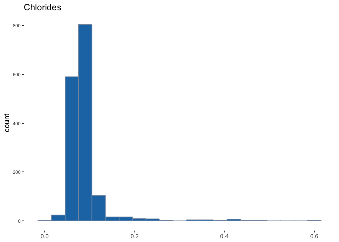

Red Wine - Data Exploration
===========================

Introduction to the dataset
---------------------------

This dataset has 1599 observations realted to the red variant of the Portuguese "Vinho Verde" wine. Variables are the physiochemical and sensory attributes of this variant of red wine. There are no missing values. Information on the 13 variables in this dataset can be seen below:

``` r
str(redwine)
```

    ## 'data.frame':    1599 obs. of  13 variables:
    ##  $ X                   : int  1 2 3 4 5 6 7 8 9 10 ...
    ##  $ fixed.acidity       : num  7.4 7.8 7.8 11.2 7.4 7.4 7.9 7.3 7.8 7.5 ...
    ##  $ volatile.acidity    : num  0.7 0.88 0.76 0.28 0.7 0.66 0.6 0.65 0.58 0.5 ...
    ##  $ citric.acid         : num  0 0 0.04 0.56 0 0 0.06 0 0.02 0.36 ...
    ##  $ residual.sugar      : num  1.9 2.6 2.3 1.9 1.9 1.8 1.6 1.2 2 6.1 ...
    ##  $ chlorides           : num  0.076 0.098 0.092 0.075 0.076 0.075 0.069 0.065 0.073 0.071 ...
    ##  $ free.sulfur.dioxide : num  11 25 15 17 11 13 15 15 9 17 ...
    ##  $ total.sulfur.dioxide: num  34 67 54 60 34 40 59 21 18 102 ...
    ##  $ density             : num  0.998 0.997 0.997 0.998 0.998 ...
    ##  $ pH                  : num  3.51 3.2 3.26 3.16 3.51 3.51 3.3 3.39 3.36 3.35 ...
    ##  $ sulphates           : num  0.56 0.68 0.65 0.58 0.56 0.56 0.46 0.47 0.57 0.8 ...
    ##  $ alcohol             : num  9.4 9.8 9.8 9.8 9.4 9.4 9.4 10 9.5 10.5 ...
    ##  $ quality             : int  5 5 5 6 5 5 5 7 7 5 ...

Univariate Plots & Analysis
===========================

The primary output variable of this dataset is the 'quality' variable. This looks like a good place to start the exploration of this dataset. Let us look at a histogram of the quaity variable


Fixed acidity is the non volatile acids present in wine. Wines in this dataset has an average fixed acidity of 8.32 g/dm^3. We can see from the above histogram that the distribution is a bit negatively skewed, indicating the presence of a few outliers with high amounts of fixed acidity.


The volatile acidity of the wine is the amount of acetic acid in wine, which at too high of levels can lead to an unpleasant, vinegar taste. Wines in this dataset have an average volaitle acidity of 0.52 g/dm^3. From the distribution, we see that like fixed acidity, the volatile acidity is also negatively skewed, with a few wines having high volatile acidity (outliers). We suspect that these wines might be of low quality.


Citric acid is found in small quantities. It can add freshness and flavor to the wine. We see that there are less number of wines with higher levels of citric acid. On average, wines in this dataset have 0.27 g/dm^3 of citric acid.


Residual sugar, which is the amount of sugar that remains after fermentaiton stops, has a heavily skewed long tailed distribution with many outliers. This is more clearly seen in the below boxplot




Chlorides, which is the amount of salt in the wine, is also a heavily skewed distribution, similar to residual sugar. There are many outliers. On average, wines in this dataset have 0.08 g/dm^3 of cholrides in them. As we can see from the plot, there are outliers that go as high as 0.6 g/dm^3 of chlorides.


Free sulfur dioxide: the free form of SO2 exists in equilibrium between molecular SO2 (as a dissolved gas) and bisulfite ion; it prevents microbial growth and the oxidation of wine. There are more wines in the dataset with low levels of free sulfur dioxide, than those with more. On average, wines contain 15.87 mg/dm^3 of free sulfur dioxide


This is the amount of free and bound forms of sulfur dioxide. Similar to free sulfur dioxide, the distribution of total sulfur dioxide is also positively skewed with few wines with extreme values of total sulfur dioxide. There are two large outliers in this dataset as can be seen from the below box plot.


Density of water in the wine is one of the few normally distributed variables in this dataset. The median and mean is roughly the same (0.99 g/cm^3)


Another variable in the dataset which is normally distributed. pH describes how acidic or basic the wine is on a scale of 0(very acidic) to 14 (very basic). Most wine fall in the 3-4 range.


Sulphates refer to additives that can contribute to sulfur dioxide in the wine. The distribution of sulphates is positively skewed with a few outliers. The average amout of sulphates is 0.6 g/dm^3.


There are less number of wine with high % of alcohol content in them. Average alcohol content is around 10.5%.

We can construct a new variable called total acidity, which is the sum of fixed and volatile acidity.


The distribution of total acidity looks very similar to that of fixed acidity, since the volatile acidity in all wines are very small.

### Structure of your dataset?

The dataset has 1599 observations and 13 variables. All variables are numeric. Most of the variables are positively skewed, excelpt pH, density and volatile acidity, which appear to be normally distributed.

### Main feature(s) of interest in your dataset?

There are 11 input variables and one output variables which is the quality of the wine. The 11 input variables which relate to acidity, residual sugar, chlorides, free and total sulpher dioxide, density, ph, sulphates and alcohol are physicochemical in nature, while the output variable 'quality' is based on sensory data.

### Features of interest

Fixed and Volatile acidity, alcohol, density and sulphates look interesting and are good candidates for further exploration

### Did you create any new variables from existing variables in the dataset?

Total Acidity, which is the sum of fixed and volatile acidity was created. Since volatile acidity is significantly low, the distribution of total acidity closely resembles that of fixed acidity.

Bivariate Plots & Analysis
==========================


Alcohol is the first thing that comes to mind when I think of wine, so I wanted to see the relationship between the quality of wine and its alcohol content. Red wine of higher quality seem to have more alcohol content. The relationship is not a perfect linear one because most the wine are of medium quality (5,6) and the alcohol content in quality 6 is more spread out than in quality 5. However, there are more instances of high alcohol winerated at a higher quality. Correlation is not particularly high (0.5). However, we can clearly see from the boxplots that the average alcohol content goes higher as we go from mid to top quality wines.


From the data dictionary, we know that high levels of volatile acidity is not the mark of good wine, as high levels gives it an unpleasant, vinegar taste. We suspected during when we looked at the distribution of volatile acidity in wines that higher levels might correspond to low quality wines. This plot seems to confirm our intuition. High quality wine tend to have less volatile acidity, which makes intuitive sense. Correlation is not particularly high (-0.4), but we see from the box plots that high quality wines tend to have low volatile acidity.


Next, I wanted to explore if high levels of total acidity in the wine had any relationship to the density of water in it. From the plot, we see a clear linear relationship between acidity and density. The larger the acidity, the more density in the wine. Correlation (0.7)


Lastly, how does density of the wine correspond to the alcohol content in it. Higher water density corresponds to lower alcohol content and vice versa, as can be seen from the linear relationship between alcohol and density. Correlation is not particularly high (0.5)

Although pH was not one of the original features of interest, it is interesting that there is a linear relationship between pH and fixed.acidity


Multivariate Plots Section
==========================

In the Bivariate analysis, we saw interesting relationships between quality, acidity, density and alcohol. We will now explore further by adding more than two dimensions to these plots.


In the bivariate analysis, we saw the relationship between alcohol and density. The higher the alcohol content, the lower the density of the wine. I wondered how acidity fit into this relationship. Adding total acidity as a color scale to the alcohol - density plot, we see that total acidity is higher in wine with high density and spread across wine with various levels of alcohol


Citric acid is found only in small quantities in wine. Can it tell us more when we look at it with the relationshop we know that exists between density and acidity? Content of citric acid is low in wine with low total acidity and density. This is seen by the light green dots towards the bottom left and the concentration dark green dots towards the top right. Here we have taken the log of the citric acid variable.Correlation of citric acid to fixed.acidity is 0.7


So far, we have seen a few very interesting relationships between variables. Our outcome variable is quality. Given the linear relationship between density and alcohol, can encoding quality as color onto this plot tell us more about these three variables? Here, we see that most of the low rated wines are concentrated in the high density-low alcohol area (top left). the high rated wines are found more in the low density high alcohol are (bottom right). When we draw regression lines for each quality category, we see that the lines for the lower quality categories are towards the left and have a lower slope as opposed to the higher quality lines, which are steeper and to the right.

------------------------------------------------------------------------

Final Plots and Summary
=======================

### Plot One


### Description One

This plot shows the distribution of wine by their quality, the output variable of this dataset. As can be seen, the distribution is middle heavy, which means that most wine are of quality 5 and 6 on the scale of (1-10). We do not have the information of wine across the quality scale. Hence we are limited in some of our inferences becausewe are trying to infer with only few of the low and high rated wines.

### Plot Two


### Description Two

The larger the density of the wine, the greater its acidity. We understand more about the wine when we look at how this relates to citric acid, which is found only in small quantities in wine. Lower levels of fixed acidity and density is associated with lower levels of citric acid in the wine. Relationship of citric acid is more stronger with fixed acidity (which intuitively makes sense). The correlation between these two is (0.67)

### Plot Three


### Description Three

Higher water density corresponds to lower alcohol content and vice versa. High quality wine tend to be less dense and high in alcohol %. Low and average rated wines tend to be high in density and low in alcohol. This is seen by the concentration of such wines to the top left of the plot. As we see from the regression lines of the wine quality categories, the lines for the lower quality categories are towards the left and have a lower slope as opposed to the higher quality lines, which are steeper and to the right. This inference would have been stronger if we had more instances of wine which are ranked low and high.

------------------------------------------------------------------------

Reflection
==========

After exploring the Red Wine dataset, several interesting relationships were discovered - The distribution of the features, relationship between features - notabily those between acidity and density, acidity and alchohol and alcohol and acidity to quality. The relation between alcohol and density, acidity, density and traces of citric acid, residual sugar etc. gives us a good picture of what constitues wine and how these features of wine relate to each other.

Ideally, such a dataset has the potential to tell us how these features relate to the overall quality of the wine. Although we were able to make a few inferences about quality, the fact that most wine were of medium quality didnt give strenght to these inferences. This was a challenge in this analysis. With more data, we would be able to explore these relationship in detail and with more confidence.

With more data, I would also be confident to perform a regression analysis using the input features to predict the output variable - quality.

References
----------

<http://www.calwineries.com/learn/wine-chemistry/acidity> <https://s3.amazonaws.com/udacity-hosted-downloads/ud651/wineQualityInfo.txt>
